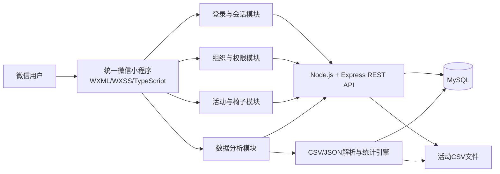
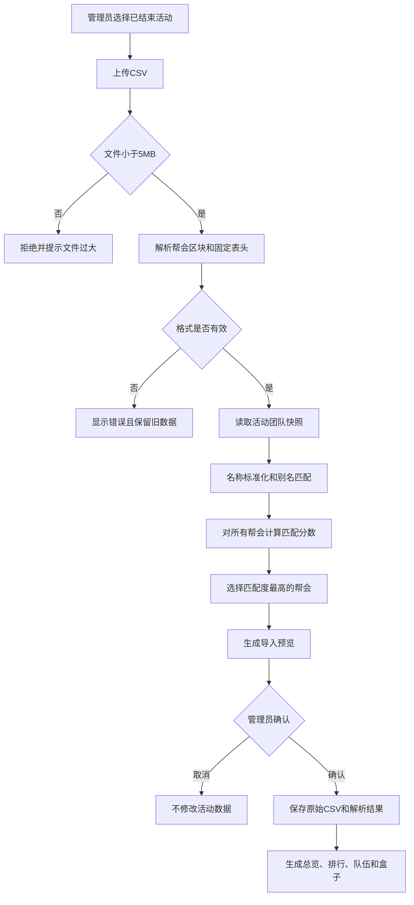

# 逆水寒联赛组织与数据分析综合项目文档

> 文档版本：V1.0  
> 编写日期：2026年9月9日  
> 文档类型：两个现有项目的综合分析、功能规划与界面草图  
> 说明：本文描述两个项目能够组合形成的完整系统，并明确区分“当前已实现功能”和“整合后的目标功能”。

## 1. 文档依据

本文综合以下两个项目：

### 1.1 项目一：逆水寒手游助手

- 项目目录：`D:\wechattttt\nishuihanliansai`
- 项目类型：微信原生小程序 + Node.js/Express 后端 + MySQL
- 主要职责：玩家登录、组织管理、活动发布、椅子报名、代理报名、预设表和活动 CSV 留档。
- 参考文档：`D:\wechattttt\nishuihanliansai\项目分析与说明文档.md`

### 1.2 项目二：九肆联赛数据分析小程序

- 项目目录：`xiaochengxu/hhhhhhtml/jiusi-data-dashboard-frontend/demo`
- 项目类型：微信原生离线小程序
- 主要职责：团队 JSON 导入、比赛 CSV 解析、帮会自动匹配、玩家排行、队伍统计和自定义分析盒子。
- 参考文档：当前目录下的 `项目说明.md`。

## 2. 综合项目概述

两个项目可以组合为一套覆盖“赛前组织、赛中报名、赛后分析”的逆水寒联赛综合管理系统。

项目一解决的是联赛开始前和活动进行中的组织管理问题：

- 谁属于哪个帮会或俱乐部。
- 谁拥有管理员或助理权限。
- 什么时候举行活动。
- 60 人或 120 人如何安排座位。
- 玩家如何本人报名或代理报名。
- 活动结束后如何保存原始 CSV 文件。

项目二解决的是活动结束后的数据分析问题：

- 玩家属于哪个团和哪支队伍。
- CSV 中多个帮会应该分析哪一个。
- 每个玩家、队伍和团的数据表现如何。
- 如何自由组合队伍和玩家进行专项统计。
- 如何保存多套分析盒子供复盘使用。

综合后的系统可以形成以下业务闭环：

```text
玩家登录
   ↓
创建或加入帮会/俱乐部
   ↓
管理员发布联赛活动
   ↓
使用椅子和预设表完成人员安排
   ↓
玩家本人报名或代理报名
   ↓
活动结束并上传比赛 CSV
   ↓
读取活动成员和团队编排
   ↓
自动匹配 CSV 中的参赛帮会
   ↓
生成总览、玩家、队伍和分析盒子结果
   ↓
保存本场比赛的复盘数据
```

## 3. 当前状态与整合目标

### 3.1 当前状态

两个项目目前是相互独立的：

| 对比项 | 逆水寒手游助手 | 九肆联赛数据分析 |
| --- | --- | --- |
| 核心阶段 | 赛前、赛中 | 赛后 |
| 前端技术 | 微信原生小程序 + TypeScript | 微信原生小程序 + JavaScript |
| 后端 | Node.js + Express | 无后端 |
| 数据库 | MySQL | 无数据库 |
| 身份系统 | Demo 登录 + JWT | 无登录 |
| 组织管理 | 帮会、俱乐部、成员、角色 | 团、队、玩家配置 |
| 活动管理 | 发布、公开、延期、历史 | 无 |
| 报名方式 | 本人、代理、预设 | 无 |
| CSV | 上传、查看、删除原始文件 | 固定格式解析和统计 |
| 分析能力 | 暂无 | 总览、排行、队伍、盒子 |
| 数据保存 | MySQL + 文件目录 | 微信本地存储 |

### 3.2 整合目标

整合后建议形成一个统一小程序和一套后端服务：

- 使用项目一的登录、组织、权限、活动和报名体系。
- 使用项目二的 CSV 解析、名称匹配、统计指标和分析盒子体系。
- 将分析结果与具体活动绑定，而不是只保存一个当前数据集。
- 将组织成员转换为团队配置，减少重复录入玩家。
- 将活动结束后上传的 CSV 直接送入分析模块，不再要求用户重复选择文件。
- 普通玩家查看自己有权限访问的比赛数据，助理和管理员负责导入、配置和管理。

## 4. 综合功能结构图

下面的结构图表示“界面对应里面的功能”。

```mermaid
flowchart TD
    SYS[逆水寒联赛综合管理系统]

    SYS --> LOGIN[登录页]
    LOGIN --> LOGIN1[昵称与职业登录]
    LOGIN --> LOGIN2[保存登录会话]

    SYS --> ACT[活动首页]
    ACT --> ACT1[帮会活动]
    ACT --> ACT2[俱乐部活动]
    ACT --> ACT3[公开活动]
    ACT --> ACT4[活动筛选与状态]
    ACT --> ACT5[进入活动详情]

    SYS --> ORG[组织中心]
    ORG --> ORG1[创建或加入帮会]
    ORG --> ORG2[创建或加入俱乐部]
    ORG --> ORG3[成员与权限管理]
    ORG --> ORG4[邀请码与创建码]
    ORG --> ORG5[活动预设表]

    SYS --> SIGN[活动详情]
    SIGN --> SIGN1[60或120人椅子矩阵]
    SIGN --> SIGN2[本人报名]
    SIGN --> SIGN3[代理报名]
    SIGN --> SIGN4[预设与锁定]
    SIGN --> SIGN5[撤离与强制清除]
    SIGN --> SIGN6[公开与延期]

    SYS --> MANAGE[活动管理]
    MANAGE --> MANAGE1[发布活动]
    MANAGE --> MANAGE2[历史活动]
    MANAGE --> MANAGE3[上传与管理CSV]
    MANAGE --> MANAGE4[进入数据分析]

    SYS --> ANALYSIS[数据分析中心]
    ANALYSIS --> OVERVIEW[分析总览]
    OVERVIEW --> OVERVIEW1[团级汇总]
    OVERVIEW --> OVERVIEW2[阵营指标对比]
    OVERVIEW --> OVERVIEW3[玩家排行榜]

    ANALYSIS --> PLAYERS[玩家分析]
    PLAYERS --> PLAYERS1[搜索玩家与职业]
    PLAYERS --> PLAYERS2[切换指标排行]
    PLAYERS --> PLAYERS3[玩家详情]

    ANALYSIS --> TEAMS[队伍分析]
    TEAMS --> TEAMS1[团和小队结构]
    TEAMS --> TEAMS2[队伍汇总]
    TEAMS --> TEAMS3[缺失数据提示]

    ANALYSIS --> BOXES[分析盒子]
    BOXES --> BOX1[创建与重命名盒子]
    BOXES --> BOX2[选择队伍]
    BOXES --> BOX3[自由增减玩家]
    BOXES --> BOX4[选择统计指标]
    BOXES --> BOX5[按队伍或玩家查看]
    BOXES --> BOX6[排序、展开和删除]

    SYS --> ME[个人信息]
    ME --> ME1[编辑玩家资料]
    ME --> ME2[查看我的组织]
    ME --> ME3[管理入口]
    ME --> ME4[退出登录]
```



## 5. 建议的统一页面结构

整合后建议将底部导航统一为四个主入口：

```text
┌────────┬────────┬────────┬────────┐
│  活动  │  组织  │  分析  │  我的  │
└────────┴────────┴────────┴────────┘
```

| 主入口 | 页面与功能 |
| --- | --- |
| 活动 | 帮会活动、俱乐部活动、公开活动、活动详情、报名、活动管理 |
| 组织 | 我的组织、创建/加入组织、成员、邀请码、权限、预设表 |
| 分析 | 总览、玩家、队伍、盒子、团队配置和比赛数据 |
| 我的 | 玩家资料、职业、橙武、区服、管理入口和退出登录 |

数据分析中心内部建议使用二级切换：

```text
总览  |  玩家  |  队伍  |  盒子
```

这样既保留项目一简洁的主导航，也能够完整容纳项目二的四个分析页面。

## 6. 页面与功能对应表

| 页面 | 主要使用者 | 页面核心功能 | 数据来源 |
| --- | --- | --- | --- |
| 登录页 | 所有玩家 | 登录、职业、副职、橙武 | 玩家接口 |
| 活动首页 | 所有玩家 | 活动分类、筛选、报名状态 | 活动接口 |
| 组织中心 | 所有玩家 | 加入、创建、创建码 | 组织接口 |
| 组织管理 | 助理、管理员 | 成员、角色、邀请码、预设表 | 组织与成员接口 |
| 活动详情 | 玩家、管理者 | 椅子、本人报名、代理报名、预设 | 活动与椅子接口 |
| 活动管理 | 助理、管理员 | 发布活动、CSV、进入分析 | 活动与 CSV 接口 |
| 分析总览 | 有查看权限的成员 | 团级汇总、对比、排行 | 解析后的比赛数据 |
| 玩家列表 | 有查看权限的成员 | 搜索、切换指标、排行 | 玩家比赛指标 |
| 玩家详情 | 有查看权限的成员 | 全指标、相对水平、所属队伍 | 玩家与团队数据 |
| 队伍分析 | 有查看权限的成员 | 队伍汇总、成员和缺失数据 | 团队配置 + CSV |
| 分析盒子 | 有查看权限的成员 | 自定义组合和统计 | 团队、玩家、指标 |
| 盒子编辑 | 助理、管理员或授权成员 | 选队、选人、选指标 | 团队和比赛数据 |
| 个人信息 | 当前玩家 | 编辑资料、组织入口、退出 | 玩家与组织接口 |

## 7. 综合业务流程图


## 8. 综合技术架构图



### 8.1 建议复用关系

| 综合模块 | 建议来源 |
| --- | --- |
| 登录、JWT 和请求封装 | 项目一 |
| 帮会、俱乐部和角色权限 | 项目一 |
| 活动、椅子、代理报名和预设表 | 项目一 |
| 活动 CSV 上传和文件管理 | 项目一 |
| 固定 CSV 状态机解析器 | 项目二 |
| 玩家名称标准化和别名匹配 | 项目二 |
| 多帮会自动选择 | 项目二 |
| 指标聚合和格式化 | 项目二 |
| 团队、玩家和分析盒子 | 项目二 |
| 深色统计界面 | 项目二 |

## 9. 数据衔接设计

### 9.1 组织成员与团队配置

项目一中的帮会或俱乐部成员只描述“玩家属于哪个组织”，项目二还需要“玩家属于哪个团和哪支小队”。整合后需要在组织内部增加团队编排：

```text
帮会/俱乐部
└─ 团
   └─ 小队
      └─ 玩家
```

建议为每个活动保存一份团队快照。即使活动结束后组织成员发生变化，历史比赛仍能使用活动发生时的团队名单进行分析。

### 9.2 椅子与团队的关系

椅子负责报名位置，团和小队负责战术组织，两者不应直接等同。建议保存以下关系：

```text
活动 → 椅子 → 报名玩家
活动 → 团队快照 → 团 → 小队 → 玩家
```

管理员可以把已经报名的玩家分配到团和小队，也可以从历史团队模板中直接生成本次编排。

### 9.3 CSV 与活动的关系

项目一当前把 CSV 作为活动附件保存，项目二把 CSV 作为当前数据集读取。整合后建议变为：

```text
一场活动
├─ 一份原始 CSV 文件
├─ 一个被选中的帮会数据区块
├─ 一份解析后的玩家指标
├─ 一份团队快照
└─ 多个分析盒子
```

### 9.4 多帮会自动匹配

上传 CSV 后，系统按照以下顺序确定本场活动需要分析的帮会：

1. 与活动团队快照匹配玩家数量最高。
2. 匹配率最高。
3. CSV 中出现位置靠前。

如果匹配人数为零，应要求管理员再次确认，避免把对手帮会数据错误绑定到本方活动。

## 10. 角色与综合权限

| 功能 | 普通玩家 | 助理 | 管理员 |
| --- | :---: | :---: | :---: |
| 查看允许访问的活动 | 是 | 是 | 是 |
| 本人报名、代理报名、撤离 | 是 | 是 | 是 |
| 查看活动分析结果 | 是 | 是 | 是 |
| 创建个人分析盒子 | 可选 | 是 | 是 |
| 发布、公开和延期活动 | 否 | 是 | 是 |
| 上传或删除活动 CSV | 否 | 是 | 是 |
| 编辑本场团队编排 | 否 | 是 | 是 |
| 创建公共分析盒子 | 否 | 是 | 是 |
| 管理成员和邀请码 | 否 | 是 | 是 |
| 设置或取消助理 | 否 | 否 | 是 |

如果允许普通玩家创建盒子，建议区分：

- 个人盒子：只有创建者可见。
- 公共盒子：由助理或管理员创建，对组织成员可见。

## 11. 界面草图

以下草图用于表示页面结构、内容层级和按钮位置，不代表最终颜色或精确尺寸。

### 11.1 登录页

```text
┌──────────────────────────────┐
│        🎮 逆水寒手游助手      │
│     联赛组织 · 报名 · 分析     │
├──────────────────────────────┤
│ 名字                         │
│ [ 请输入玩家名字            ] │
│                              │
│ 主职业       [ 铁衣       ▾ ] │
│ 副职业       [ 可选填写      ] │
│ 橙武         [ 开关 ]         │
│                              │
│       [ 登录 / 注册 ]         │
└──────────────────────────────┘
```

对应功能：玩家登录、创建 Demo 账号、保存 token 和玩家资料。

### 11.2 活动首页

```text
┌──────────────────────────────┐
│ 帮会活动 | 俱乐部 | 公开活动  │
├──────────────────────────────┤
│ 当前帮会：九肆                │
│ [发布活动] [组织中心]          │
├──────────────────────────────┤
│ 周六联赛              报名中  │
│ 九肆 · 52/60 已报名            │
│ 2026-09-12 19:00 ~ 21:00      │
├──────────────────────────────┤
│ 周日训练              已结束  │
│ 九肆 · 60/60 已报名            │
└──────────────────────────────┘
  活动       组织       分析       我的
```

对应功能：活动分类、组织筛选、活动状态、报名人数、公开活动和活动详情入口。

### 11.3 组织中心

```text
┌──────────────────────────────┐
│ 我的组织                     │
│ 🏯 九肆       管理员 · 管理 › │
│ 🏛 联赛训练营  成员 · 查看  › │
├──────────────────────────────┤
│ 加入组织                     │
│ 类型 [帮会 ▾]                 │
│ 邀请码 [________] [加入]      │
├──────────────────────────────┤
│ 创建组织                     │
│ 创建码 [________]             │
│ 名称   [________]             │
│ [创建帮会] [创建俱乐部]       │
└──────────────────────────────┘
```

对应功能：查看组织、邀请码加入、创建码建组织、进入组织管理。

### 11.4 组织管理页

```text
┌──────────────────────────────┐
│ 九肆                管理员    │
│ [生成邀请码] [预设表]          │
│ [活动管理 / 数据分析]          │
├──────────────────────────────┤
│ 成员（60）                    │
│ 封不覺   龙吟   成员 [设助理]  │
│ 家猫素问 素问   助理 [取消]    │
│ ……                           │
├──────────────────────────────┤
│ 团队编排                     │
│ 进攻一团 · 一队      6人  ›   │
│ 进攻一团 · 二队      6人  ›   │
│ [编辑本场团队] [使用历史模板]  │
└──────────────────────────────┘
```

对应功能：成员、角色、邀请码、预设表、团队模板和活动管理入口。

### 11.5 活动详情与椅子页

```text
┌──────────────────────────────┐
│ 周六联赛              报名中  │
│ 九肆 · 52/60                  │
│ 19:00 ~ 21:00                │
│ [公开活动] [延期]              │
├──────────────────────────────┤
│ 椅子：□空 ■本人 ◆代理 🔒预设   │
│ ┌────┐ ┌────┐ ┌────┐ ┌────┐ │
│ │01  │ │02  │ │03  │ │04  │ │
│ │报名│ │封不│ │代报│ │预设│ │
│ └────┘ └────┘ └────┘ └────┘ │
│ …… 60个或120个椅子            │
└──────────────────────────────┘
```

点击空椅子后的报名弹窗：

```text
┌──────── 椅子 #01 ────────────┐
│ [本人报名]  [代理报名]          │
│ 姓名 [________________]        │
│ 职业 [铁衣                ▾]   │
│                              │
│        [取消] [确认报名]        │
└──────────────────────────────┘
```

对应功能：椅子状态、本人报名、代理报名、预设、撤离和管理清除。

### 11.6 活动管理与 CSV 页

```text
┌──────────────────────────────┐
│ 发布活动                     │
│ 名称 [周六联赛____________]   │
│ 规模 [60人 ▾]                 │
│ 开始 [2026-09-12 19:00____]   │
│ 结束 [2026-09-12 21:00____]   │
│ 预设 [帮会60人模板        ▾]   │
│          [发布活动]            │
├──────────────────────────────┤
│ 历史活动                     │
│ 周六联赛             已结束   │
│ [上传CSV] [查看] [进入分析]    │
└──────────────────────────────┘
```

对应功能：发布活动、查看历史、上传/查看/删除 CSV、进入本场数据分析。

### 11.7 数据分析总览页

```text
┌──────────────────────────────┐
│ 周六联赛 · ༺九肆✈ · 60人     │
│ 总览 | 玩家 | 队伍 | 盒子      │
├──────────────────────────────┤
│ 团队阵营总览                 │
│ ┌────────┐ ┌────────┐        │
│ │进攻一团│ │进攻二团│        │
│ │18人    │ │18人    │        │
│ │伤害/治疗│ │伤害/治疗│        │
│ └────────┘ └────────┘        │
│ ┌──────── 防守团 ──────────┐ │
│ │24人 · 击败 · 伤害 · 治疗 │ │
│ └──────────────────────────┘ │
├──────────────────────────────┤
│ 阵营指标对比                 │
│ 进攻一团 ███████  43,875,692 │
│ 进攻二团 █████    34,308,170 │
│ 防守团   █████████ 170,612,239│
├──────────────────────────────┤
│ 玩家排行榜             更多 › │
└──────────────────────────────┘
```

对应功能：比赛选择、团级汇总、横向对比、排行榜和分析入口。

### 11.8 玩家分析页

```text
┌──────────────────────────────┐
│ [搜索玩家 / 职业___________]  │
│ 击败 | 助攻 | 玩家伤害 | 治疗 │
├──────────────────────────────┤
│ 1  封不覺   龙吟    38,900,000│
│    ██████████████████         │
│ 2  万斯琳   潮光    35,200,000│
│    ████████████████           │
│ 3  ……                        │
└──────────────────────────────┘
```

对应功能：搜索、职业筛选、切换指标、玩家排行和玩家详情。

### 11.9 队伍分析页

```text
┌──────────────────────────────┐
│ 进攻一团                     │
├──────────────────────────────┤
│ 进攻一团 · 一队       6/6有数据│
│ 击败 25/8  伤害 1800万  治疗… │
│ [封不覺·龙吟] [玩家乙·素问]   │
│ [玩家丙·铁衣] [玩家丁·神相]   │
├──────────────────────────────┤
│ 进攻一团 · 二队       5/6有数据│
│ [玩家戊·无数据]               │
└──────────────────────────────┘
```

对应功能：按照团和小队展示成员、有效数据人数和队伍指标。

### 11.10 分析盒子页

```text
┌──────────────────────────────┐
│ 本场数据：༺九肆✈              │
│ 数据人数 60    团队匹配 60/60  │
│ [团队配置] [比赛CSV]           │
│ [查看示例]              [恢复] │
├──────────────────────────────┤
│ [新建分析盒子]                │
├──────────────────────────────┤
│ 分析盒子 1  18人   收起 ▴  ✕  │
│ 队伍                 编辑 →   │
│ [进攻一团·一队] [进攻一团·二队]│
│ 玩家（18）                    │
│ [封不覺] [万斯琳] [更多…]      │
│ 汇总数据             改指标 → │
│ [击败 65/20] [伤害 4387万]     │
│ 按队伍 | 按玩家       收起 ▴   │
│ ┌队伍────人数────伤害────治疗┐│
│ │一队      6    ……     ……   ││
│ └───────────────────────────┘│
└──────────────────────────────┘
```

对应功能：导入状态、导入报告、盒子创建、改名、展开、删除、汇总和明细表格。

### 11.11 盒子队伍与玩家编辑页

```text
┌──────────────────────────────┐
│ 编辑队伍与玩家               │
├──────────────────────────────┤
│ 选择队伍（自动带入全部队员）  │
│ 进攻一团                     │
│ [✓ 一队 6人] [✓ 二队 6人]     │
│ 进攻二团                     │
│ [  三队 6人] [  四队 6人]     │
├──────────────────────────────┤
│ 玩家明细：已选18人  手动调整2 │
│ [搜索玩家 / 职业___________]  │
│ 铁衣             已选 2/3 收起│
│   ✓ 玩家甲              已选  │
│   ○ 玩家乙              选择  │
│ 素问             已选 3/3 展开│
│                              │
│ [全选结果] [清空结果] [按队重置]│
│        [保存队伍与玩家]        │
└──────────────────────────────┘
```

对应功能：小队自动选人、职业树、玩家搜索、逐人增减和手动差异保存。

### 11.12 玩家详情页

```text
┌──────────────────────────────┐
│ 封不覺                       │
│ 龙吟 · 进攻一团一队           │
├──────────────────────────────┤
│ 击败/清泉           18 / 3    │
│ ███████████████              │
│ 助攻                 126      │
│ ███████████                  │
│ 对玩家伤害        38,900,000  │
│ ██████████████████           │
│ 治疗值             1,200,000  │
│ ███                          │
└──────────────────────────────┘
```

对应功能：个人完整指标、所属队伍、全员相对水平和名称复制。

## 12. 关键数据模型建议

综合系统除项目一现有数据表外，建议补充以下概念：

| 数据对象 | 作用 |
| --- | --- |
| `activity_team_snapshot` | 保存某场活动使用的团队配置快照 |
| `activity_group` | 保存活动中的团 |
| `activity_team` | 保存活动中的小队 |
| `activity_team_member` | 保存玩家与活动小队的关系 |
| `activity_dataset` | 保存被选中的帮会、导入报告和解析状态 |
| `activity_player_stat` | 保存每名玩家的固定统计指标 |
| `analysis_box` | 保存盒子名称、视图和创建者 |
| `analysis_box_team` | 保存盒子选择的小队 |
| `analysis_box_player_override` | 保存手动增加或移除玩家 |
| `analysis_box_metric` | 保存盒子选择的指标 |

如果第一阶段只要求完成可运行 Demo，可以先把解析结果以 JSON 保存到数据库，后续再拆成明细表。

## 13. CSV 和团队配置的综合导入流程



## 14. 分析盒子计算规则

盒子的基础玩家来自所选小队，并只统计在当前活动 CSV 中存在数据的玩家：

```text
基础玩家 = 所选小队成员 ∩ 当前活动CSV玩家
有效玩家 = 基础玩家 + 手动添加玩家 - 手动移除玩家
盒子结果 = 对有效玩家的已选指标执行求和聚合
```

例如：

- 一队和二队共有 12 名配置玩家。
- 其中 11 人有本场 CSV 数据。
- 手动移除 1 人。
- 从未编队 CSV 玩家中添加 2 人。
- 最终盒子统计人数为 `11 - 1 + 2 = 12` 人。

## 15. 两个项目整合时需要解决的问题

### 15.1 前端语言统一

项目一使用 TypeScript，项目二使用 JavaScript。建议整合时把分析模块逐步迁移为 TypeScript，并为玩家、队伍、指标、数据集和盒子定义明确接口。

### 15.2 CSV 格式统一

项目一当前只负责保存 CSV 原文，项目二要求固定字段和多帮会区块结构。整合后上传接口应调用同一套解析规则，避免前端能解析而后端不能验证。

### 15.3 本地状态迁移到活动数据

项目二当前一次只维护一个本地数据集。整合后需要将数据绑定到活动 ID，使多场活动可以分别保存团队快照、比赛数据和分析盒子。

### 15.4 身份与别名

组织成员具有数据库玩家 ID，而 CSV 通常只有玩家名称。数据库玩家仍应使用稳定 ID，名称和别名仅用于导入匹配，不能作为永久主键。

### 15.5 权限控制

前端隐藏按钮不能代替权限校验。上传 CSV、编辑公共团队、删除数据和发布公共盒子等操作必须由后端再次校验助理或管理员角色。

### 15.6 历史数据

成员可能改名、换职业、退出组织或更换队伍，因此每场活动需要保存成员名称、职业和团队关系快照，不能只读取当前组织状态。

## 16. 建议实施顺序

### 第一阶段：建立统一入口

- 在项目一增加“数据分析”主入口。
- 活动管理页增加“进入分析”。
- 将项目二的总览、玩家、队伍和盒子页面迁入项目一。
- 暂时继续使用本地状态完成界面联调。

### 第二阶段：打通活动 CSV

- 上传 CSV 后调用固定格式解析器。
- 保存帮会候选和匹配报告。
- 把解析结果与活动 ID 绑定。
- 从活动详情直接进入对应比赛分析。

### 第三阶段：打通团队编排

- 为组织增加团、小队和玩家配置。
- 支持从组织成员生成团队配置。
- 发布活动时复制团队快照。
- 保留 JSON 导入和导出作为批量配置工具。

### 第四阶段：持久化分析盒子

- 保存公共盒子和个人盒子。
- 保存队伍、玩家差异和指标选择。
- 支持跨设备查看和历史活动复盘。

### 第五阶段：生产化改造

- 接入真实微信登录。
- 使用环境变量管理数据库、JWT 和 API 地址。
- 使用 HTTPS 和合法域名。
- 增加分页、日志、备份和异常监控。
- 建立独立测试数据库，避免测试影响业务数据。

## 17. 综合项目优势

- 覆盖联赛从组织到复盘的完整生命周期。
- 帮会和俱乐部可以复用同一套活动能力。
- 60 人和 120 人活动均可使用。
- 报名名单、团队编排和比赛数据能够互相验证。
- 支持玩家别名和多帮会 CSV 自动识别。
- 支持团、队、玩家三级统计。
- 支持自由组合分析盒子，适合战术复盘。
- 活动与分析绑定后，可以形成长期历史数据资产。

## 18. 当前风险与注意事项

- 两个项目当前尚未在代码层真正合并，本文的统一页面和数据结构属于整合目标设计。
- 项目一仍使用 Demo 登录、固定 JWT 密钥、固定数据库配置和本地 HTTP API。
- 项目二的数据目前只保存在微信本地，没有账号同步。
- 项目一的 CSV 上传与项目二的固定 CSV 校验尚未连接。
- 数据库初始化脚本和冒烟测试可能清理业务数据，执行前必须使用独立测试库并确认备份。
- 真机访问后端时不能继续使用 `127.0.0.1`，需要 HTTPS 域名或可访问的局域网地址。

## 19. 综合评价

项目一已经建立组织、权限、活动和报名的业务基础，项目二已经建立团队、比赛数据和分析盒子的复盘能力。二者组合后，可以从单独的“活动报名工具”和“离线数据分析工具”升级为一套完整的联赛组织与数据分析平台。

整合工作的关键不是简单复制页面，而是通过活动 ID、玩家稳定 ID、团队快照和解析后的比赛数据建立统一的数据关系。完成这些衔接后，管理员可以在同一个小程序中发布活动、安排人员、完成报名、上传比赛数据并查看复盘结果；普通玩家也能够在权限范围内查看活动、个人表现、队伍表现和历史比赛。

该综合方案适合作为微信小程序课程设计、毕业设计和联赛管理原型。第一阶段可优先完成统一入口和 CSV 分析页面迁移，随后再逐步将本地分析状态迁移到后端数据库，实现多活动、跨设备和多人协作。
