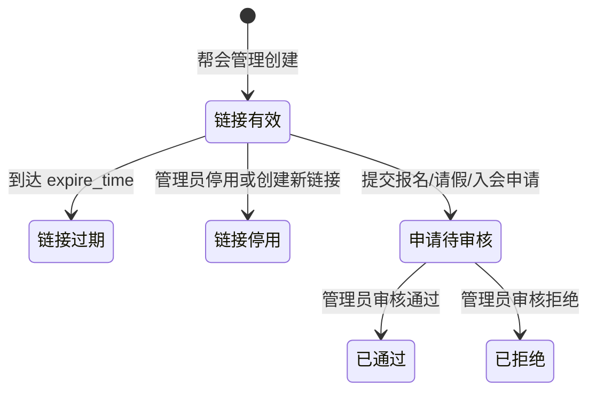
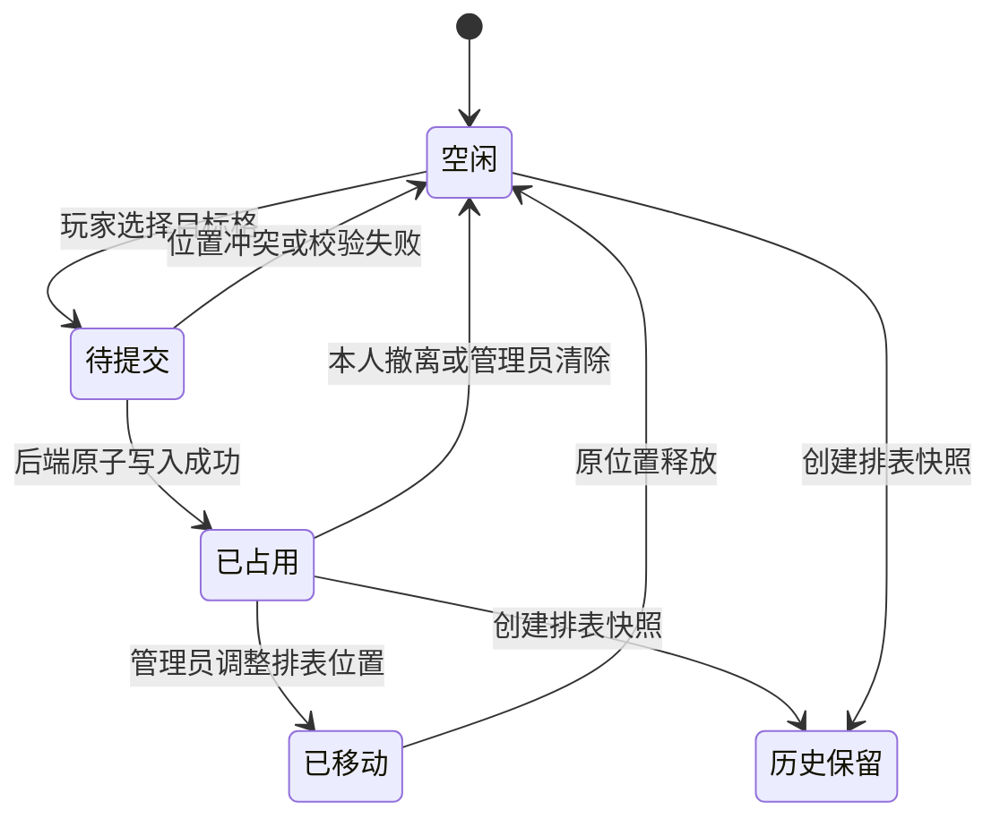
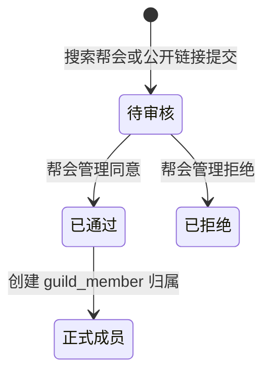
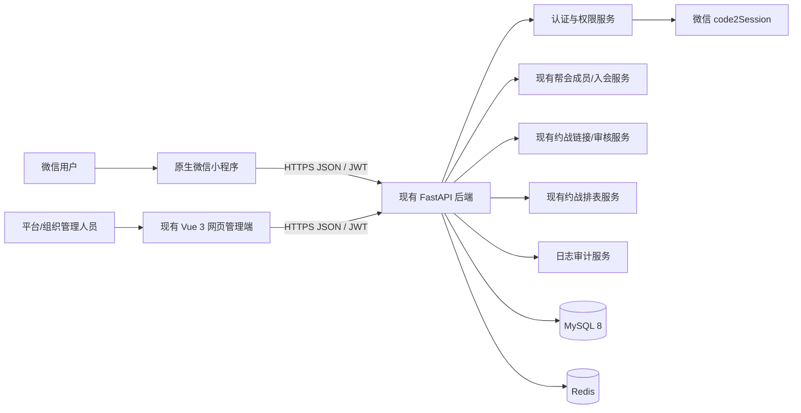
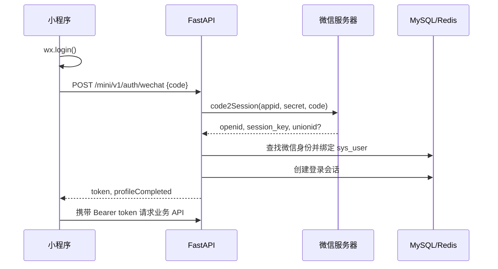

# 逆水寒手游活动助手微信小程序 软件工程设计文档

> 文档版本：V0.11 权限对齐稿  
> 编制日期：2026-08-23  
> 文档状态：需求已整理，关键歧义待产品方确认，尚未进入编码  
> 适用目录：`xiaochengxu`  
> 技术基线：原生微信小程序 + 现有 FastAPI 后端 + SQLAlchemy Async + MySQL 8 + Redis

---

## 0. 文档说明

### 0.1 编制目的

本文将原始需求、24 轮确认问答和现有项目真实结构重新整理为可执行的软件工程基线，覆盖开发前应具备的主要文档内容：

- 产品需求文档（PRD）
- 软件需求规格说明（SRS）
- 业务规则与用例说明
- 权限模型
- 领域模型与状态机
- 系统概要设计
- 数据库逻辑设计
- REST API 草案
- 小程序信息架构与页面规划
- 并发、事务、安全和隐私设计
- 测试与验收计划
- 发布、迁移和回滚计划
- 风险、待确认项和需求追踪矩阵

本文不是代码，也不是可直接执行的 SQL。所有表结构和接口在正式开发前还需生成对应迁移脚本、Pydantic 模型和 OpenAPI 定义。

### 0.2 需求来源

1. 产品方关于玩家、帮会、俱乐部、活动、椅子和代理报名的初始描述。
2. 围绕公开活动、代理报名、邀请码、权限、延期、时间冲突等问题的 24 轮确认。
3. 当前项目代码库的真实技术架构与已有帮会模块。
4. 当前 `xiaochengxu` 原生微信小程序脚手架。

### 0.3 本次重构原则

- 以产品方明确回答为最高优先级。
- AI 在旧对话中自行补出的结论，不自动视为已确认需求。
- 修正原类图、SQL 和伪代码中无法落地或互相冲突的部分。
- 小程序复用现有后端和数据库体系，不新建另一套 Spring Boot 或 Node.js 后端。
- 以当前 FastAPI 代码、系统角色、帮会成员、入会申请、约战审核和约战排表为一期实现真源，能复用的接口与服务不重复开发。
- 小程序中的产品术语必须映射到现有业务实体；“邀请码”“抢椅子”等名称不再额外引入一套平行数据库模型。
- 网页管理端和小程序端共享业务数据，但客户端职责不同。
- 业务规则由后端统一执行，不能只依赖小程序前端校验。

### 0.4 当前结论等级

| 标记 | 含义 |
|---|---|
| 已确认 | 产品方已经明确回答，可进入设计基线 |
| 设计推荐 | 原需求未明确，本文给出建议，确认后冻结 |
| 待确认 | 会影响数据结构或核心流程，编码前必须确认 |
| 后续版本 | 不进入第一期 MVP，但保留扩展位置 |

---

## 1. 产品定义（PRD）

### 1.1 产品名称

暂定名称：**逆水寒手游活动助手**。

### 1.2 产品定位

面向逆水寒手游玩家、帮会和俱乐部的轻量活动协同工具。通过微信小程序完成玩家资料登记、申请加入帮会、约战报名、请假和“抢椅子”式排表交互；通过现有网页管理端继续完成成员审核、约战审核、分团排表和平台级配置。

### 1.3 要解决的问题

1. 微信群中的活动报名依赖接龙，职业、人数和代理关系难以核对。
2. 帮会与俱乐部规模不同，现有工具难以同时表达 60 人和 120 人活动。
3. 椅子有精确职业限制，并存在管理员预设、本人报名和代理报名三种来源。
4. 多个管理员协作时容易出现重复占位、误删和权限边界不清。
5. 活动公开分享后，需要支持组织外玩家报名，同时保留组织内部管理权。

### 1.4 产品目标

- 让普通玩家在 3 步内完成活动报名。
- 让管理员通过模板快速生成 60/120 个职业座位。
- 保证同一椅子在并发报名时最多只有一个成功者。
- 明确记录本人、代理和管理员预设三类占位来源。
- 对帮会、俱乐部、公开活动使用统一且可审计的权限规则。
- 与现有网页端共用账号、后端、数据库和部署体系。

### 1.5 成功指标（上线后采集）

| 指标 | 目标 |
|---|---:|
| 活动详情到报名完成率 | ≥ 70% |
| 正常网络下报名写接口 P95 | ≤ 800 ms（不含微信网络抖动） |
| 并发抢同一椅子的数据错误 | 0 |
| 权限越权严重缺陷 | 0 |
| 活动创建使用模板的比例 | ≥ 60% |
| 崩溃率 | < 0.5% |

### 1.6 角色与使用者

- **平台超级管理员**：现有系统角色 `admin`，拥有全部菜单和系统级管理能力。
- **帮会管理员**：现有系统角色 `common`，界面名称为“帮会管理”；该账号是当前帮会数据的所有者和管理范围标识。
- **帮会成员**：现有系统角色 `user`、角色 ID `100`；所有注册玩家默认获得此角色，可完善资料、申请加入帮会、报名和使用个人功能。
- **帮会助理**：账号继续保留“帮会成员”基础角色，同时附加系统角色 `guild_assistant`；该角色在原项目“系统管理 -> 角色管理”中可见、可编辑，但实际操作范围还必须受具体帮会助理关系限制。
- **组织外注册玩家**：查看公开活动并报名。
- **未登录访客**：是否可查看公开活动，尚待确认；默认建议只能预览，报名必须登录并完成玩家资料。

---

## 2. 项目范围

### 2.1 第一期 MVP 包含

1. 微信登录、账号绑定和玩家资料维护。
2. 注册账号默认分配现有“帮会成员”角色，并允许完善个人玩家资料。
3. 复用现有帮会搜索、入会申请、约战临时链接和入会审核流程加入帮会。
4. 帮会管理员复用现有“帮会管理”角色及其数据范围。
5. 复用现有约战报名、请假、审核和已通过报名列表。
6. 以现有“分团管理 -> 约战排表”为“抢椅子”的数据和操作基础。
7. 在约战排表基础上逐步增加移动端单格占位、职业限制、本人/代理来源和并发保护。
8. 组织内可见和公开分享入口。
9. 历史排表、操作日志、异常提示和基础统计。

### 2.2 第一期不包含

- 游戏官方 API 自动同步角色数据。
- 支付、会员收费和交易能力。
- 即时聊天、语音和群机器人。
- 自动组队、战斗力评分和智能排阵。
- 复杂消息订阅策略；可在第二期接入微信订阅消息。
- 完整离线能力；核心写操作必须联网。
- 多角色账号切换；第一期推荐一个系统账号对应一个主玩家档案。
- 立即重构现有帮会表为全新的通用组织表。
- 在约战排表需求尚未确认前另建独立的 `activity_seat` 抢座系统。

### 2.3 与现有网页端的边界

- 小程序负责高频移动流程：登录、资料、加入组织、活动查看、报名和分享。
- 网页端继续负责平台系统管理、复杂数据维护、运营审计和已有帮会功能。
- 业务规则必须放在后端服务层，小程序与网页端调用同一规则。
- 不复制现有后端为第二套服务，不让两套数据库分别保存同一组织数据。

---

## 3. 术语表

| 术语 | 规范定义 |
|---|---|
| 系统账号 | 现有 `sys_user` 中的登录主体 |
| 微信身份 | 微信 `openid` 与系统账号的绑定关系；`session_key` 不下发客户端 |
| 玩家档案 | 游戏内角色资料，与系统账号一对一（MVP） |
| 帮会成员 | 现有系统角色 `user`（ID 100）；注册账号的默认角色，不等于已经通过某个帮会的入会审核 |
| 帮会管理 | 现有系统角色 `common`；组织中的帮会管理员及当前帮会数据所有者 |
| 帮会 | 当前由帮会管理账号 `user_id` 标识的数据范围，成员保存在现有 `guild_member` |
| 俱乐部 | 后续扩展的跨帮会协同范围；人数不设上限，落库方式尚待确认 |
| 组织 | 文档中的产品统称，不代表第一期必须新增 `organization` 表 |
| 约战临时链接 | 现有帮会管理员生成的高熵公开链接，可提交约战报名、请假或入会申请 |
| 入会申请 | 玩家提交后由帮会管理员在现有入会审核流程中通过或拒绝的记录 |
| 约战排表 | 现有 `guild_schedule`、团队、小队、成员分配和 Univer 工作簿组成的排表能力 |
| 椅子 | 小程序用语；一期映射为某张约战排表中的可占用单格/排表位置，不另建平行活动座位真源 |
| 抢椅子 | 玩家对约战排表目标格提交占位请求，最终形成或更新排表成员分配 |
| 本人报名 | 操作者用自己的玩家档案占据椅子 |
| 代理报名 | 操作者填写他人的名字与职业占据椅子，不创建临时玩家账号 |
| 管理员预设 | 管理人员在发布前或发布后直接填入玩家快照并锁定 |
| 公开活动 | 所有符合登录/资料要求的玩家均可查看和报名，不受组织成员限制 |
| 报名期 | 当前时间早于报名截止时间，且活动已经发布、未取消 |
| 延长期 | 已使用延期机会，且新的报名截止时间尚未到达 |
| 已结束 | 当前时间达到或超过报名截止时间，不能新增或修改普通报名 |

---

## 4. 已确认业务规则

### 4.1 玩家规则

| 编号 | 规则 |
|---|---|
| BR-PLAYER-01 | 玩家档案包含玩家名、游戏 UID（可空）、区服、主职业、副职业（可空）、是否橙武、联系微信、备注（可空） |
| BR-PLAYER-02 | 橙武由玩家手工维护，可在个人设置中修改 |
| BR-PLAYER-03 | 玩家只能加入一个帮会 |
| BR-PLAYER-04 | 玩家可加入多个俱乐部，不设置俱乐部数量上限 |
| BR-PLAYER-05 | 账号与游戏玩家档案分离，报名时保存必要快照，避免资料修改影响历史活动 |

### 4.2 组织规则

| 编号 | 规则 |
|---|---|
| BR-ORG-01 | 帮会和俱乐部均不设置成员人数上限；后端不得以 80/800 或其他固定人数拒绝加入 |
| BR-ORG-02 | 新注册账号固定分配系统角色“帮会成员”`user`（ID 100），该角色使用户具备个人功能和申请入会资格 |
| BR-ORG-03 | “帮会管理”系统角色 `common` 表示帮会管理员；现有服务以其 `user_id` 作为帮会数据范围 |
| BR-ORG-04 | “帮会助理”作为项目内置系统角色显示在原角色管理中，账号同时保留“帮会成员”角色；不得直接授予完整 `common` 角色 |
| BR-ORG-05 | 帮会管理员可在成员管理中绑定/取消本帮会助理关系；超级管理员在用户管理中分配助理系统角色，在角色管理中配置其菜单/按钮权限 |
| BR-ORG-06 | 同一组织的管理员和助理对该组织全部活动具有管理权，不采用“谁创建谁管理” |
| BR-ORG-07 | 成员被踢出组织时，清理该组织所有未结束活动中的相关活动椅子；已结束活动保留历史 |
| BR-ORG-08 | 助理有效权限 = 助理角色已勾选权限 ∩ 当前帮会有效助理关系；缺少任一条件均拒绝操作 |

### 4.3 约战临时链接与入会申请规则

| 编号 | 规则 |
|---|---|
| BR-INVITE-01 | 小程序“邀请码”复用现有约战临时链接的 `invite_code`；默认有效 24 小时，可配置 1–720 小时 |
| BR-INVITE-02 | 帮会管理员可停用或删除自己创建的链接；超级管理员可按现有管理范围介入 |
| BR-INVITE-03 | 创建新链接时，现有服务会停用该管理员此前的有效链接；一期保留这一行为，若要多链接并存需单独变更 |
| BR-INVITE-04 | 有效链接可提交约战报名、请假和入会申请；链接本身不直接把玩家写入帮会成员表 |
| BR-INVITE-05 | 入会申请必须经现有 `guild/join` 审核流程通过后才建立帮会成员关系，且不做人数容量检查 |

### 4.4 活动规则

| 编号 | 规则 |
|---|---|
| BR-ACT-01 | 每个活动必须且只能属于一个组织 |
| BR-ACT-02 | 帮会只能发布 60 人活动；俱乐部可发布 60 或 120 人活动 |
| BR-ACT-03 | 活动时间精确到分钟，包含实际开始时间、实际结束时间和报名截止时间 |
| BR-ACT-04 | 活动可以组织内可见，也可以公开；公开活动允许组织外玩家报名 |
| BR-ACT-05 | 活动结束后不能直接改为公开；使用有效延期重新开放后是否可公开按后续确认执行 |
| BR-ACT-06 | 全部活动永久保留，管理人员可按报名中、延长期、已结束等状态分区查看 |
| BR-ACT-07 | 活动时间段只要与本人已报名活动存在任何重叠，就弹出警告；玩家仍可确认继续 |
| BR-ACT-08 | 活动没有“进行中”业务状态；报名截止后进入已结束展示状态 |
| BR-ACT-09 | 延期最多一次，最多延长 120 分钟 |

### 4.5 椅子与报名规则

| 编号 | 规则 |
|---|---|
| BR-SEAT-01 | 每把椅子可限制一个职业，或设置为不限职业 |
| BR-SEAT-02 | 管理人员可使用系统/组织模板，也可修改并保存为组织共享模板 |
| BR-SEAT-03 | 模板应用到活动时必须复制快照；后续修改模板不得改变既有活动 |
| BR-SEAT-04 | 管理员预设是强制锁定，普通玩家不能覆盖；管理人员可清除 |
| BR-SEAT-05 | 普通玩家占位后，其他普通玩家不能修改；本人可撤离，管理人员可强制清除 |
| BR-SEAT-06 | 同一操作者可以本人占一把椅子，并代理他人占多把椅子 |
| BR-SEAT-07 | 每个操作者在单场活动最多创建 12 个有效代理报名 |
| BR-SEAT-08 | 代理报名只保存被代理人的名字、职业等报名快照，不创建游客玩家对象 |
| BR-SEAT-09 | 代理椅子显示被代理人名字，并显示代理标记；详情中显示代理操作者 |
| BR-SEAT-10 | 管理人员强制清除后椅子恢复为空，任何符合条件的玩家均可报名 |

---

## 5. 原设计错误与修订说明

| 原设计问题 | 修订方案 |
|---|---|
| 建议另建 Spring Boot/Node.js 后端 | 复用当前 FastAPI、SQLAlchemy Async、MySQL 8、Redis 和 JWT 基础设施 |
| `InviteCode.isUsed` 表示一次性 | 删除一次性语义，改为有效期、撤销状态和可选使用次数上限 |
| `activity.status` 使用 `NOW()` 的 MySQL 生成列 | 不使用依赖当前时间的生成列；由服务层计算展示阶段，查询按截止时间过滤 |
| 为小程序另建一套 `organization/activity/seat` 真源 | 一期复用 `sys_role`、`guild_member`、入会申请、约战报名和 `guild_schedule`；只在现有结构确实缺字段时增量扩展 |
| 将“邀请码”设计为直接入会码 | 映射为现有约战临时链接；玩家提交入会申请，管理员审核后才加入 |
| 将“抢椅子”设计为独立 `activity_seat` 系统 | 映射为“分团管理 -> 约战排表”的单格占位和成员分配，后续按排表需求优化 |
| 椅子只关联 `Player` | 使用座位分配快照，兼容代理报名、组织外玩家和未注册的管理员预设玩家 |
| 只在椅子上存当前占用人 | 当前引用与历史分配记录分离，支持撤离、强制清除和审计 |
| “活动状态无需字段”表达过度 | 生命周期状态与时间阶段分离：草稿/发布/取消是持久状态，报名中/延长期/已结束是时间派生阶段 |
| `signup_deadline <= start_time` 被直接定死 | 原答复未明确这一约束；暂不冻结，见待确认决策 D-010 |
| “延期只改报名截止时间”被当成已确认 | 产品方只明确拒绝一体式 A，未明确延期修改哪个时间；列为 P0 待确认 |
| 并发报名只写普通更新 | 必须使用数据库事务、行锁或等价原子更新，并提供幂等键 |
| 玩家 ID、用户 ID 混用 | `sys_user.user_id` 是账号 ID，`player_profile.id` 是游戏玩家档案 ID，含义严格区分 |

---

## 6. 权限模型

### 6.1 权限分层

1. **平台权限**：沿用现有 `sys_user`、`sys_role`、`sys_menu`；`admin` 为超级管理员，`common` 为帮会管理，`user` 为帮会成员，新增内置 `guild_assistant` 为帮会助理。
2. **帮会归属**：沿用 `guild_member.member_user_id` 与帮会管理账号 `user_id` 的关联，不新增重复成员关系。
3. **资源归属权限**：帮会管理接口继续按当前用户角色和资源 `owner_user_id/user_id` 校验数据范围。
4. **组织内部助理**：助理账号同时拥有 `user` 和 `guild_assistant` 角色，并绑定一个有效的帮会助理范围；不直接授予全局 `common` 角色。
5. **活动公开权限**：仅改变查看和报名范围，不授予帮会管理权限。

### 6.2 权限矩阵

| 操作 | 平台管理员 | 帮会管理员 | 帮会助理 | 帮会成员 | 组织外玩家 |
|---|:---:|:---:|:---:|:---:|:---:|
| 创建/停用组织 | 是 | 否 | 否 | 否 | 否 |
| 设置/取消助理 | 可审计介入 | 是 | 否 | 否 | 否 |
| 生成/撤销邀请码 | 可审计介入 | 是 | 是 | 否 | 否 |
| 踢出普通成员 | 可审计介入 | 是 | 是 | 否 | 否 |
| 踢出助理 | 可审计介入 | 先取消助理 | 否 | 否 | 否 |
| 创建/编辑活动 | 可审计介入 | 是 | 是 | 否 | 否 |
| 管理椅子模板 | 可维护系统模板 | 是 | 是 | 否 | 否 |
| 管理员预设椅子 | 可审计介入 | 是 | 是 | 否 | 否 |
| 强制清除椅子 | 可审计介入 | 是 | 是 | 否 | 否 |
| 查看组织内活动 | 是 | 是 | 是 | 是 | 否 |
| 查看公开活动 | 是 | 是 | 是 | 是 | 是 |
| 本人报名 | 是 | 是 | 是 | 是 | 是（公开活动） |
| 代理报名 | 是 | 是 | 是 | 是 | 是（公开活动） |
| 撤离本人椅子 | 当前占位人 | 当前占位人 | 当前占位人 | 当前占位人 | 当前占位人 |

### 6.3 鉴权原则

- 前端隐藏按钮仅用于体验，不能替代后端鉴权。
- 帮会资源接口必须校验 `owner_user_id/user_id` 归属，不能只校验菜单权限字符。
- 平台超级管理员的介入行为必须写操作日志。
- 代理报名记录的代理人信息仅对本人和有管理权的人员完整展示；普通查看者只显示代理标记。

### 6.4 原项目角色管理展示与配置

- 在原项目“系统管理 -> 角色管理”中增加项目内置角色“帮会助理”，建议权限字符为 `guild_assistant`；角色 ID 由初始化迁移确定，业务代码不得依赖固定数字。
- “帮会助理”与“超级管理员”“帮会管理”“帮会成员”一样出现在角色列表，可由超级管理员编辑菜单和按钮权限；允许编辑权限，不允许普通用户自行提升角色。
- 权限树直接复用现有菜单管理中的权限节点，不创建小程序专属重复权限。至少覆盖：
  - 入会申请查看、通过、拒绝：`guild:review:member:list/approve/reject`。
  - 约战报名审核：已有 `guild:review:battle:list`，并补齐按钮权限 `guild:review:battle:approve/reject`。
  - 约战排表查看、编辑、快照、历史和应用：`guild:schedule:*` 中由超级管理员勾选的节点。
- 当前正式初始化基线尚未完整包含成员审核通过/拒绝按钮，约战审核通过/拒绝接口也尚未绑定独立按钮权限；实现时必须把四个按钮节点补入 `project_menu_baseline.json`、MySQL/PostgreSQL 初始化 SQL 和版本化迁移，并给对应控制器添加权限依赖。
- 角色管理只定义“助理可以做什么”；用户管理负责给账号附加 `guild_assistant` 角色；帮会成员管理负责指定“该账号协助哪个帮会”。
- 后端接口不能只调用 `UserInterfaceAuthDependency`：除菜单/按钮权限外，还必须校验当前资源 `owner_user_id` 是否等于该用户有效助理关系中的帮会管理员 ID。
- 超级管理员保持全权限；帮会管理员保持自己帮会的所有权；助理不能创建独立帮会所有权、修改系统角色或跨帮会读取数据。

---

## 7. 功能需求规格（SRS）

### 7.1 登录与玩家档案

- **FR-AUTH-01**：小程序使用 `wx.login` 获取一次性 code，由后端向微信服务器交换 `openid/session_key`。
- **FR-AUTH-02**：后端把微信身份绑定到现有 `sys_user`，签发与网页端兼容的访问令牌。
- **FR-AUTH-04**：未绑定账号的注册流程必须复用后端注册服务，并固定分配角色 ID `100`（帮会成员）；小程序不得自行提交或选择角色 ID。
- **FR-AUTH-03**：`session_key` 不返回小程序、不写日志、不作为长期登录凭证。
- **FR-PROFILE-01**：首次使用必须补全玩家名、区服、主职业和橙武状态。
- **FR-PROFILE-02**：UID、副职业、联系微信和备注允许为空。
- **FR-PROFILE-03**：玩家可修改档案；历史报名继续显示报名时快照。

### 7.2 组织与成员

- **FR-ORG-01**：展示当前帮会和全部已加入俱乐部。
- **FR-ORG-02**：玩家可通过现有搜索接口申请加入帮会，也可从有效约战临时链接提交入会申请。
- **FR-ORG-03**：同一玩家加入第二个帮会时拒绝并说明当前帮会。
- **FR-ORG-04**：玩家可以主动退出组织。
- **FR-ORG-05**：管理人员可以查看成员、调整助理、踢出成员。
- **FR-ORG-06**：成员退出或被踢后的活动座位清理规则由事务统一执行。
- **FR-ORG-07**：帮会和俱乐部的成员列表不显示“剩余容量”，入会流程不执行固定人数上限校验。
- **FR-ORG-08**：原角色管理必须展示“帮会助理”角色及其现有帮会菜单/按钮权限；超级管理员修改后立即影响所有助理账号。
- **FR-ORG-09**：用户只有同时具备助理角色与目标帮会助理关系时，才能执行已勾选的审核或排表操作。

### 7.3 约战临时链接与入会申请

- **FR-INVITE-01**：帮会管理员复用 `POST /guild/battle-registration/invite` 创建约战临时链接。
- **FR-INVITE-02**：可设置 1–720 小时有效期，并复用现有停用、删除和列表能力。
- **FR-INVITE-03**：公开链接可显示约战摘要，并提供报名、请假、申请加入帮会入口，不泄露无关成员信息。
- **FR-INVITE-04**：过期或停用时拒绝提交；入会申请提交成功后进入现有待审核列表，不直接入会。

### 7.4 活动与模板

- **FR-ACT-01**：管理人员首先复用现有约战临时链接、约战报名审核和当前约战排表；新活动元数据按排表优化需求增量补充。
- **FR-ACT-02**：活动保存为草稿后可预设椅子，发布后仍可管理。
- **FR-ACT-03**：帮会创建 120 人活动时后端必须拒绝。
- **FR-ACT-04**：组织内活动仅所属成员可见；公开活动在公开入口可见。
- **FR-ACT-05**：活动详情显示组织、时间、截止时间、备注、容量、报名数量和椅子网格。
- **FR-ACT-06**：结束活动进入历史分区，不删除椅子和报名记录。
- **FR-TEMPLATE-01**：系统可提供预设模板；组织可复制、修改、保存组织模板。
- **FR-TEMPLATE-02**：模板每项包含椅子编号和职业限制，容量必须与活动类型一致。

### 7.5 报名与椅子

- **FR-SEAT-01**：点击空椅子即选择约战排表中的一个目标单格/位置，并提交本人或代理占位。
- **FR-SEAT-02**：本人报名默认带入档案名字、职业和橙武，可按活动要求选择活动职业。
- **FR-SEAT-03**：代理报名输入被代理人名字和职业，保存代理操作者 ID。
- **FR-SEAT-04**：职业不符合椅子要求时拒绝报名。
- **FR-SEAT-05**：代理有效数量达到 12 时拒绝第 13 个代理报名。
- **FR-SEAT-06**：报名成功后立即刷新椅子版本；失败时提示该椅子已被占用。
- **FR-SEAT-07**：本人可撤离本人报名；代理撤离权限见待确认 D-004。
- **FR-SEAT-08**：管理人员清除椅子时必须填写或选择原因，并写审计日志。
- **FR-SEAT-09**：椅子详情显示玩家名、职业、橙武和报名来源；代理信息按权限脱敏。

### 7.6 时间冲突和延期

- **FR-TIME-01**：本人报名时查询该玩家已报名且实际时间段重叠的活动。
- **FR-TIME-02**：存在重叠时返回警告和冲突活动摘要，用户二次确认后仍可报名。
- **FR-TIME-03**：冲突确认必须绑定原请求条件，防止绕过职业、容量和椅子检查。
- **FR-EXTEND-01**：管理人员每个活动最多延期一次，输入分钟数为 1–120。
- **FR-EXTEND-02**：延期时间语义见待确认 D-010，确认前不得编写最终迁移和接口。

### 7.7 分享与历史

- **FR-SHARE-01**：已发布活动可生成小程序分享卡片，路径携带不可猜测的活动分享标识。
- **FR-SHARE-02**：私有活动分享打开后仍校验组织成员身份。
- **FR-SHARE-03**：公开活动可从公开列表和分享卡片进入。
- **FR-HISTORY-01**：管理人员可查看本组织全部历史活动及每次椅子变动记录。
- **FR-HISTORY-02**：普通玩家可查看自己参加或代理报名过的活动历史。

---

## 8. 核心用例

### UC-01 首次微信登录并建立玩家档案

**参与者**：微信用户。  
**前置条件**：小程序可访问生产 HTTPS 域名。  
**主流程**：

1. 小程序调用 `wx.login` 获取 code。
2. 后端校验 code 并取得 `openid`。
3. 已绑定账号直接登录；未绑定身份创建或引导绑定系统账号。
4. 系统检查玩家档案完整性。
5. 未完成档案时进入资料页，保存后进入活动首页。

**异常流程**：code 失效、微信接口超时、账号停用、玩家名不合法。  
**后置条件**：客户端只保存访问令牌和必要展示信息。

**角色结果**：新注册系统账号固定为“帮会成员”（角色 ID 100）；成为具体帮会成员仍需提交并通过入会审核。

### UC-02 通过约战链接申请加入帮会

**参与者**：已登录且有玩家档案的用户。  
**主流程**：打开约战临时链接 -> 查看帮会/约战摘要 -> 填写玩家资料 -> 提交入会申请 -> 帮会管理员在入会审核中通过 -> 建立成员关系。  
**关键约束**：帮会唯一、链接有效性、重复申请幂等；不校验帮会或俱乐部人数上限。  
**后置条件**：活动首页立即出现该组织活动。

### UC-03 创建并发布活动

**参与者**：组织管理员或助理。  
**主流程**：

1. 选择所属组织。
2. 选择 60/120 容量；帮会只显示 60。
3. 填写活动实际时间、报名截止、可见范围和备注。
4. 选择模板或创建空椅子。
5. 调整每把椅子职业限制并可预设玩家。
6. 保存草稿，预览后发布。

**后置条件**：椅子和模板均已快照化；活动进入可见列表。

### UC-04 本人报名抢占排表位置

**参与者**：有权限查看活动的玩家。  
**主流程**：选择约战排表空格 -> 后端校验当前排表、成员身份、职业和冲突 -> 写入成员分配/工作簿 -> 刷新排表。  
**并发结果**：优化后的接口必须保证同一排表位置并发占位最多一个成功；具体单格坐标和锁粒度在排表专项需求中冻结。

### UC-05 代理报名

**参与者**：有权限报名的玩家。  
**主流程**：选择代理报名 -> 输入被代理人名字和职业 -> 检查单场代理计数 -> 原子占位 -> 椅子显示代理标记。  
**后置条件**：不创建临时玩家，只保存被代理人快照和代理操作者引用。

### UC-06 强制清除椅子

**参与者**：活动所属组织管理员或助理。  
**主流程**：打开椅子详情 -> 选择强制清除 -> 填写原因 -> 事务释放椅子 -> 写历史记录。  
**后置条件**：椅子恢复为空，可重新报名。

### UC-07 踢出成员并清理座位

**参与者**：有成员管理权的管理人员。  
**主流程**：校验目标职位 -> 锁定成员关系 -> 标记离开 -> 查询该组织未结束活动中的相关有效分配 -> 释放椅子 -> 记录原因 -> 提交事务。  
**异常流程**：助理尝试踢管理员/助理、成员状态已经失效、并发报名正在发生。

### UC-08 延期活动

**参与者**：组织管理员或助理。  
**前置条件**：活动未使用延期机会。  
**主流程**：输入 1–120 分钟 -> 后端锁定活动 -> 按 D-010 的最终规则修改时间 -> 标记已延期 -> 重新计算展示阶段。  
**后置条件**：历史中记录原时间、新时间、操作者和理由。

---

## 9. 领域模型设计

```mermaid
classDiagram
    class SysUser {
        +bigint userId
        +string userName
        +string status
    }
    class WechatIdentity {
        +bigint id
        +bigint userId
        +string openid
        +string unionid
    }
    class PlayerProfile {
        +bigint id
        +bigint userId
        +string playerName
        +string gameUid
        +string serverName
        +string profession
        +string secondaryProfession
        +boolean hasOrangeWeapon
        +string wechatContact
    }
    class SysRole {
        +bigint roleId
        +string roleKey
        +string roleName
    }
    class GuildMember {
        +bigint memberId
        +bigint userId
        +bigint memberUserId
        +string playerName
        +string playerClass
    }
    class GuildAssistantScope {
        +bigint id
        +bigint userId
        +bigint ownerUserId
        +string status
        +datetime grantedAt
    }
    class GuildJoinApplication {
        +bigint applicationId
        +bigint applicantUserId
        +bigint guildId
        +string playerName
        +string status
    }
    class GuildBattleInvite {
        +bigint inviteId
        +string inviteCode
        +bigint ownerUserId
        +datetime expireTime
        +string status
    }
    class GuildBattleRegistration {
        +bigint registrationId
        +bigint inviteId
        +string registrationType
        +bigint memberId
        +string approvalStatus
    }
    class GuildSchedule {
        +bigint scheduleId
        +bigint userId
        +string scheduleName
        +string scheduleType
        +bigint sourceScheduleId
    }
    class GuildScheduleWorkbook {
        +bigint workbookId
        +bigint scheduleId
        +json workbookJson
    }
    class GuildScheduleTeam {
        +bigint teamId
        +bigint scheduleId
        +string teamName
    }
    class GuildScheduleSquad {
        +bigint squadId
        +bigint teamId
        +int maxMembers
    }
    class GuildScheduleAssignment {
        +bigint assignmentId
        +bigint scheduleId
        +bigint memberId
        +bigint teamId
        +bigint squadId
        +int orderNum
    }
    class ScheduleSlotExtension {
        +bigint scheduleId
        +string sheetId
        +int rowIndex
        +int columnIndex
        +bigint operatorUserId
        +string sourceType
        +int version
    }

    SysUser "1" --> "0..1" WechatIdentity
    SysUser "1" --> "0..1" PlayerProfile
    SysUser "0..*" --> "0..*" SysRole
    SysUser "1" --> "0..*" GuildMember
    SysUser "1" --> "0..*" GuildAssistantScope
    GuildBattleInvite "1" --> "0..*" GuildBattleRegistration
    GuildBattleInvite "1" --> "0..*" GuildJoinApplication
    GuildSchedule "1" --> "0..1" GuildScheduleWorkbook
    GuildSchedule "1" --> "0..*" GuildScheduleTeam
    GuildScheduleTeam "1" --> "0..*" GuildScheduleSquad
    GuildSchedule "1" --> "0..*" GuildScheduleAssignment
    GuildSchedule "1" --> "0..*" ScheduleSlotExtension
```



### 9.1 聚合边界

- **账号与角色聚合**：`sys_user/sys_role`；负责注册默认“帮会成员”和后台菜单权限。
- **帮会成员聚合**：`guild_member` 与 `guild_join_application`；负责申请、审核、成员归属和退出。
- **约战邀请聚合**：`guild_battle_invite/guild_battle_registration`；负责公开链接、报名、请假和审核。
- **排表聚合**：`guild_schedule`、工作簿、团队、小队和成员分配；负责当前排表、历史、导入、分团和“抢椅子”。
- **玩家聚合**：账号、微信身份、玩家档案；负责登录和资料完整性。
- **俱乐部扩展聚合（待确认）**：只有在俱乐部业务范围、管理员关系和与帮会的关系确定后再设计；不得先复制一套帮会表。

### 9.2 关键不变量

1. 新注册账号必须获得且仅由后端分配“帮会成员”默认角色。
2. 成为系统角色“帮会成员”不代表已经加入某个帮会；实际归属以 `guild_member` 为准。
3. 一个用户同一时刻最多一个有效帮会成员关系；俱乐部归属规则另行确定。
4. 帮会和俱乐部成员数量不做固定上限校验。
5. 普通帮会管理员只能操作自己 `user_id/owner_user_id` 范围的数据。
6. 约战临时链接过期或停用后不能再提交报名、请假和入会申请。
7. 入会申请只有审核通过后才创建或关联正式帮会成员。
8. 同一排表单格同一时刻最多一个有效占位；已有工作簿和成员分配必须保持一致。
9. 历史排表和快照只读保留，不被当前排表更新覆盖。

---

## 10. 状态机设计

### 10.1 约战链接与申请生命周期



说明：

- 现有链接状态与 `expire_time` 共同决定是否可提交。
- 约战报名、请假和入会申请共享公开链接入口，但进入不同审核/处理语义。
- 小程序只提供移动端入口，不重写现有审核服务。

### 10.2 约战排表位置状态



### 10.3 入会申请状态



---

## 11. 系统架构设计

### 11.1 总体架构



### 11.2 客户端方案

- 使用当前已经创建的**原生微信小程序**，技术为 JavaScript、WXML、WXSS、Glass/Easel 与 Skyline。
- 不在第一期切换 uni-app，避免额外迁移和运行时差异。
- 建立统一请求层、令牌刷新、错误码映射、加载状态和重试策略。
- 关键写操作不自动无脑重试，必须携带幂等键。

### 11.3 后端方案

- 沿用现有 FastAPI 应用、`APIRouterPro`、Pydantic VO、Service、DAO 和 SQLAlchemy AsyncSession。
- 微信登录属于认证模块扩展；帮会、约战和排表继续调用 `module_guild` 的现有 Service，不复制业务规则。
- 小程序 API 可采用 `/mini/v1` 作为轻量适配层，但适配层只做字段转换、当前用户注入和小程序响应裁剪，不重复 DAO 和事务。
- 可直接满足需求的现有接口由小程序请求层直接复用；只有登录方式、移动端聚合返回或排表单格占位缺口才新增接口。
- 俱乐部和约战排表专项优化在需求冻结后增量加入，不作为小程序登录与入会功能的前置重构。
- 继续使用现有日志、限流、Redis 和统一响应格式。

### 11.4 与现有帮会数据的关系

一期以现有网页端数据为唯一真源：

1. `sys_role.user`（ID 100）继续表示系统级“帮会成员”能力，注册服务已经写死默认分配该角色。
2. `sys_role.common` 继续表示“帮会管理”，其账号 `user_id` 是当前帮会的所有权和数据范围标识。
3. 新增内置 `sys_role.guild_assistant`，助理账号同时保留 `user` 角色；角色菜单权限由原角色管理维护。
4. 正式成员继续写入 `guild_member`；助理范围使用独立的轻量关系记录，不复制成员资料。
5. 入会继续使用 `guild_join_application` 的提交、待审核、通过和拒绝流程。
6. 约战入口继续使用 `guild_battle_invite` 与 `guild_battle_registration`。
7. 抢椅子继续以 `guild_schedule`、`guild_schedule_workbook`、团队、小队和成员分配为基础。
8. 小程序与网页端必须调用同一 Service 或同一事务能力，禁止双写两套表。
9. 俱乐部在业务身份、管理权限和与帮会关系确认前，只保留产品入口和接口扩展位，不提前迁移现有帮会数据。

### 11.5 现有能力复用矩阵

| 小程序概念 | 现有后端能力 | 复用结论 |
|---|---|---|
| 注册玩家 | 注册服务默认 `roleIds=[100]` | 直接复用，后端不可接受客户端自选角色 |
| 搜索并申请加入帮会 | `/guild/join/search`、`/guild/join/apply` | 直接复用或由 `/mini/v1` 薄适配 |
| 查看申请/当前归属 | `/guild/join/my-status` | 直接复用 |
| 帮会管理员审核入会 | `/guild/join/pending`、`approve`、`reject` | 直接复用现有服务 |
| 生成邀请入口 | `/guild/battle-registration/invite` | 复用约战临时链接，不另建邀请码表 |
| 通过链接申请入会 | `/public/battle/{invite_code}/join` | 复用提交逻辑；登录小程序应补写当前 `applicant_user_id` |
| 约战报名/请假 | `/public/battle/{invite_code}/signup`、`leave` | 直接复用并补登录态映射 |
| 报名审核 | `/guild/battle-registration/list`、`approve`、`reject` | 直接复用 |
| 排表读取已通过报名 | `/guild/battle-registration/approved-schedule-list` | 直接复用 |
| 抢椅子/分团排表 | `/guild/schedule/*` 与工作簿接口 | 作为一期真源，后续新增移动端单格占位接口 |
| 历史排表 | `/guild/schedule/history`、快照和应用历史 | 直接复用 |

### 11.6 微信登录设计



安全要求：AppSecret 只保存在服务器环境变量；`openid` 建唯一索引；`session_key` 不写普通日志、不返回前端。

---

## 12. 小程序信息架构与页面规划

### 12.1 页面地图

```text
启动
├─ 微信登录/账号绑定
├─ 首次玩家资料
└─ 活动首页
   ├─ 帮会活动
   ├─ 俱乐部活动
   ├─ 公开活动
   └─ 活动详情/椅子网格

组织
├─ 我的帮会
├─ 我的俱乐部
├─ 搜索帮会/打开约战邀请链接
├─ 成员管理（管理员/助理）
├─ 约战链接管理（帮会管理员）
└─ 组织设置（管理员）

活动管理
├─ 新建/编辑活动
├─ 椅子模板
├─ 预设玩家
├─ 发布/分享
└─ 活动历史

我的
├─ 玩家资料
├─ 我的报名
├─ 我的代理报名
└─ 退出登录/隐私设置
```

### 12.2 首页设计

- 顶部使用清晰的分段控件：`帮会`、`俱乐部`、`公开`。
- 俱乐部数量较多时先选择俱乐部，再展示活动，不把全部活动混成一列。
- 活动卡片显示标题、组织、报名截止、实际时间、人数和状态。
- 结束活动默认折叠到历史，不占据主要报名流。

### 12.3 活动详情和椅子网格

- 60/120 把椅子使用稳定网格尺寸，不因文字变化跳动。
- 椅子至少有：编号、职业限制、玩家名、职业色、报名来源标记。
- 空椅子、普通报名、代理报名、管理员预设、已结束使用不同图标和边框，不只依赖颜色。
- 点击椅子弹出底部详情；普通玩家不能直接覆盖已占椅子。
- 报名确认弹窗明确展示“本人/代理”“职业”“冲突警告”。
- 并发失败时保留用户输入并提示重新选择椅子。

### 12.4 管理页面

- 管理操作与普通报名入口分开，降低误触。
- 强制清除、踢人、撤销邀请码等危险操作必须二次确认。
- 模板编辑采用编号网格和职业菜单，不要求管理员逐条填写文本。
- 历史页面支持按状态、组织和时间筛选。

### 12.5 可用性要求

- 最小点击区域符合微信小程序触控规范。
- 重要状态同时使用文字、颜色和图标。
- 表单错误紧邻字段显示，不能只弹一个笼统 Toast。
- 支持下拉刷新、空状态、错误状态、骨架屏和网络重试。
- 用户未完成玩家资料时，明确引导补全，不进入不可解释的空白页。

---

## 13. API 草案

### 13.1 通用约定

- Base URL：`https://<生产域名>/mini/v1`
- 鉴权：`Authorization: Bearer <token>`
- 时间传输：ISO 8601，服务端存 UTC，客户端按 `Asia/Shanghai` 展示到分钟。
- 响应沿用现有项目：`code`、`msg`、`data`。
- 写请求携带 `X-Idempotency-Key`，客户端为一次用户操作生成 UUID。
- 列表使用分页参数 `pageNum`、`pageSize`。

### 13.2 认证与资料

| 方法 | 路径 | 说明 |
|---|---|---|
| POST | `/auth/wechat` | 微信 code 登录/绑定 |
| GET | `/me` | 当前账号、玩家档案和组织摘要 |
| GET | `/player/profile` | 获取玩家档案 |
| PUT | `/player/profile` | 修改玩家档案 |

### 13.3 帮会与入会申请（现有接口）

| 方法 | 路径 | 说明 |
|---|---|---|
| GET | `/guild/join/search` | 搜索可申请的帮会 |
| POST | `/guild/join/apply` | 登录玩家提交入会申请 |
| GET | `/guild/join/my-status` | 查看当前帮会和申请状态 |
| POST | `/guild/join/quit` | 主动退出帮会 |
| GET | `/guild/join/pending` | 帮会管理员查看待审核申请 |
| POST | `/guild/join/approve` | 帮会管理员同意入会 |
| POST | `/guild/join/reject` | 帮会管理员拒绝入会 |

### 13.4 约战链接、报名与请假（现有接口）

| 方法 | 路径 | 说明 |
|---|---|---|
| POST | `/guild/battle-registration/invite` | 创建约战临时链接，默认 24 小时 |
| GET | `/guild/battle-registration/invite/list` | 查看自己范围内的链接 |
| POST | `/guild/battle-registration/invite/{inviteId}/disable` | 停用链接 |
| DELETE | `/guild/battle-registration/invite/{inviteId}` | 删除链接 |
| GET | `/public/battle/{inviteCode}` | 查看公开约战摘要 |
| GET | `/public/battle/{inviteCode}/members` | 搜索该帮会已有成员 |
| GET | `/public/battle/{inviteCode}/professions` | 获取职业选项 |
| POST | `/public/battle/{inviteCode}/signup` | 提交约战报名 |
| POST | `/public/battle/{inviteCode}/leave` | 提交请假申请 |
| POST | `/public/battle/{inviteCode}/join` | 提交入会申请，不直接入会 |
| GET | `/guild/battle-registration/list` | 管理员查看报名/请假审核列表 |
| POST | `/guild/battle-registration/approve` | 通过约战报名 |
| POST | `/guild/battle-registration/reject` | 拒绝约战报名 |
| GET | `/guild/battle-registration/approved-schedule-list` | 排表读取已通过报名 |

### 13.5 约战排表（现有接口与待增量接口）

| 方法 | 路径 | 说明 |
|---|---|---|
| GET | `/guild/schedule/current` | 获取当前排表 |
| GET | `/guild/schedule/current/workbook` | 获取当前 Univer 工作簿 |
| PUT | `/guild/schedule/current/workbook` | 保存当前工作簿 |
| PUT | `/guild/schedule/current/workbook/import` | 原子导入并替换当前工作簿 |
| GET | `/guild/schedule/history` | 查询历史排表 |
| POST | `/guild/schedule/snapshot` | 创建排表快照 |
| POST | `/guild/schedule/history/{scheduleId}/apply` | 将历史排表应用为当前排表 |
| `TBD` | `/mini/v1/schedules/{scheduleId}/slots/{sheetId}/{row}/{column}/claim` | 后续新增：本人/代理抢占单格 |
| `TBD` | `/mini/v1/schedules/{scheduleId}/slots/{sheetId}/{row}/{column}/release` | 后续新增：撤离或管理员清除单格 |

说明：`TBD` 接口必须调用现有 `ScheduleService` 或其抽出的共享事务服务，不能单独维护一份小程序座位表。

### 13.6 本人报名请求示例

```json
{
  "memberId": 10086,
  "sheetId": "sheet-01",
  "rowIndex": 9,
  "columnIndex": 2,
  "expectedVersion": 3
}
```

若存在冲突，后端返回业务错误和冲突摘要；用户确认后再次提交 `acceptConflict: true`，后端仍需重新检查椅子状态。

### 13.7 代理报名请求示例

```json
{
  "playerName": "张三",
  "profession": "素问",
  "sheetId": "sheet-01",
  "rowIndex": 9,
  "columnIndex": 3,
  "expectedVersion": 1
}
```

### 13.8 关键业务错误码

| 错误码 | 含义 |
|---|---|
| MINI_AUTH_CODE_INVALID | 微信 code 无效或过期 |
| PLAYER_PROFILE_REQUIRED | 玩家资料未完成 |
| INVITE_INVALID | 邀请码无效、过期或撤销 |
| GUILD_ALREADY_JOINED | 已加入其他帮会 |
| ORGANIZATION_PERMISSION_DENIED | 无组织管理权限 |
| ACTIVITY_SIGNUP_CLOSED | 报名已截止 |
| ACTIVITY_NOT_VISIBLE | 无权查看该活动 |
| SEAT_ALREADY_OCCUPIED | 椅子已被其他玩家占用 |
| SEAT_PROFESSION_MISMATCH | 职业不符合椅子要求 |
| PROXY_LIMIT_EXCEEDED | 单场代理数量超过 12 |
| ACTIVITY_TIME_CONFLICT | 存在时间冲突，需二次确认 |
| ACTIVITY_ALREADY_EXTENDED | 活动已经使用过延期机会 |

人数上限已取消，因此不得再返回 `ORGANIZATION_FULL`；若旧代码或旧客户端仍处理该错误码，仅保留兼容展示，不作为新业务分支。

---

## 14. 数据库逻辑设计

### 14.1 现有核心表（一期真源）

| 表名 | 用途 | 关键字段/索引 |
|---|---|---|
| `sys_user` / `sys_role` / `sys_user_role` | 账号和系统角色 | 注册默认绑定角色 ID 100 |
| `guild_member` | 正式帮会成员 | 帮会管理 `user_id`、成员账号 `member_user_id`、玩家资料 |
| `guild_join_application` | 入会申请及审核 | 申请账号、目标帮会、玩家快照、审核状态 |
| `guild_battle_invite` | 约战临时链接 | `invite_code`、`owner_user_id`、`expire_time`、`status` |
| `guild_battle_registration` | 约战报名/请假及审核 | 链接、成员、类型、审批状态、玩家快照 |
| `guild_schedule` | 当前和历史排表 | `schedule_id`、`user_id`、`schedule_type`、来源排表 |
| `guild_schedule_workbook` | Univer 工作簿 | `schedule_id UNIQUE`、`workbook_json` |
| `guild_schedule_team` | 排表团队 | `schedule_id`、名称、排序 |
| `guild_schedule_squad` | 团队小队 | `team_id`、名称、排序、`max_members` |
| `guild_schedule_assignment` | 排表成员分配 | 排表、团队、小队、成员、顺序和玩家快照 |

### 14.2 允许新增的最小扩展

| 扩展 | 是否一期必须 | 说明 |
|---|---:|---|
| `mini_wechat_identity` | 是 | 微信 `openid/unionid` 与现有 `sys_user` 绑定 |
| `guild_assistant_scope` | 是 | 绑定助理账号与帮会管理员 `owner_user_id`，记录启用状态、授权人和时间；与系统角色权限取交集 |
| 玩家档案扩展 | 视现有字段盘点 | 优先扩展/复用现有个人信息，不重复保存同一玩家名和职业 |
| 排表单格占位元数据 | 抢椅子优化时 | 仅补工作簿无法可靠承载的坐标、来源、操作者、版本和审计字段 |
| 俱乐部实体与成员关系 | 待确认 | 俱乐部领域规则确认后再设计，人数不设上限 |

### 14.3 主要索引与约束

- `mini_wechat_identity(openid)` 唯一。
- 注册事务中的 `sys_user_role` 必须包含角色 ID 100，且不信任客户端角色字段。
- `sys_role.role_key='guild_assistant'` 唯一；助理账号可同时绑定 `user` 和 `guild_assistant` 两个角色。
- `guild_assistant_scope(user_id, owner_user_id, status)` 保证同一有效授权不重复。
- `guild_member` 保持现有帮会所有者与成员账号索引，防止同一账号重复成为正式成员。
- `guild_battle_invite(invite_code)` 唯一，并按 `owner_user_id/status/expire_time` 查询。
- `guild_schedule_workbook(schedule_id)` 唯一。
- 抢椅子扩展若使用单格元数据，则 `(schedule_id, sheet_id, row_index, column_index)` 唯一。
- 不增加 `member_limit` 字段，也不添加 80/800 容量 CHECK。

### 14.4 数据演进原则

- MySQL CHECK 只作辅助，核心规则仍在服务层和事务中验证。
- 不进行破坏性的帮会数据迁移，不让小程序成为第二数据真源。
- 需要新增字段时采用版本化 SQL 迁移，空库初始化和旧库升级都必须覆盖。
- 约战排表工作簿 JSON 与规范化成员分配需要明确同步方向；一期以现有保存事务为准。
- 新增俱乐部前必须先确认其管理员、成员、活动和帮会关联规则。
- 历史排表、报名和审核记录不物理覆盖。

### 14.5 历史快照原则

报名时复制以下数据：玩家名、职业、橙武、区服（如页面需要）。后续玩家修改资料，不回写历史座位。账号引用用于权限与“我的活动”查询，快照用于历史展示。

---

## 15. 并发与事务设计

### 15.1 抢排表位置事务

1. 开启数据库事务。
2. 查询并锁定当前排表及目标单格元数据（`SELECT ... FOR UPDATE` 或带版本条件的原子更新）。
3. 校验排表归属、链接/报名状态、成员身份、目标坐标、职业限制和客户端版本。
4. 检查工作簿目标格和规范化成员分配是否均为空，避免两套表示不一致。
5. 同一事务写入成员分配、工作簿目标格、来源/操作者信息和版本。
6. 写操作日志并提交；失败时全部回滚。

同一排表位置并发请求只有第一个事务成功。Redis 锁可用于降低瞬时压力，但不能替代数据库唯一性、版本检查和事务。

### 15.2 幂等设计

- 写请求使用 `(user_id, idempotency_key, route)` 唯一记录。
- 相同幂等键重复到达时返回首次结果，不重复创建入会申请、报名或排表占位。
- 客户端超时重试必须复用原幂等键。

### 15.3 踢人/退会事务

- 锁定成员关系，防止重复退出。
- 找到当前排表中与该成员相关的成员分配和工作簿单格。
- 释放与该成员本人相关的当前排表位置；代理相关清理范围见 D-003/D-004。
- 更新成员状态、工作簿、分配和日志后一次提交。
- 历史排表只读保留。

### 15.4 延期事务

- 锁定活动行。
- 检查 `extension_count == 0`。
- 检查分钟数 1–120 和最终时间合法性。
- 更新对应时间、延期计数和审计记录。
- 使用数据库服务器时间作为判定基准，避免客户端时钟作弊。

---

## 16. 非功能需求

### 16.1 性能

- 活动详情最多 120 把椅子，一次接口返回完整轻量快照，避免 120 次请求。
- 活动列表分页，历史默认按最近时间加载。
- P95 读接口 ≤ 500 ms，写接口 ≤ 800 ms（服务端目标）。
- 至少验证 100 个并发请求竞争同一椅子时数据正确。

### 16.2 可用性与容错

- 服务端错误返回可追踪 request ID。
- 微信接口暂时失败时允许用户重试，不创建半绑定账号。
- 页面前后台切换后重新拉取椅子版本，避免使用旧状态。
- 活动、组织和玩家详情不存在时显示明确状态，不显示空白页。

### 16.3 安全

- 全站 HTTPS；生产域名加入微信小程序 request 合法域名。
- AppSecret、数据库密码和 JWT 密钥仅放服务器环境变量。
- 防越权测试覆盖所有带 `owner_user_id/user_id/schedule_id/invite_id` 的接口。
- 邀请码数据库建议保存摘要或高熵随机码，避免短码枚举。
- 登录、邀请码校验、抢座和分享入口设置限流。
- 日志不记录 token、session_key、AppSecret、微信联系方式全文。

### 16.4 隐私与合规

- 玩家 UID、联系微信、openid 属于个人信息，采集前说明用途。
- 只采集完成组织和活动功能所需信息。
- 联系微信默认仅本人和有管理权限者可见。
- 提供账号解绑、资料修改和注销入口；注销不破坏已经匿名化的活动历史。
- 按微信平台要求准备《用户隐私保护指引》。

### 16.5 可维护性

- 业务枚举集中定义，不在页面硬编码中文状态值。
- 小程序术语统一映射到 `guild/join/battle-registration/schedule`，不得再出现与现有真源并行的 `organization/activity_seat` 写模型。
- 迁移脚本版本化且可重复检测，不在每次启动时无条件改表。
- 核心规则需单元测试，权限和并发需集成测试。

---

## 17. 测试计划

### 17.1 测试层级

| 层级 | 重点 |
|---|---|
| 单元测试 | 角色映射、链接有效性、职业匹配、排表坐标、权限判定 |
| DAO/数据库测试 | 唯一约束、事务回滚、行锁、分页和索引 |
| API 集成测试 | 登录、入会申请、约战链接、报名/请假、审核、排表和错误码 |
| 并发测试 | 同一排表单格抢占、重复申请、重复约战提交 |
| 小程序组件测试 | 椅子网格、表单校验、冲突确认、加载和错误状态 |
| 端到端测试 | 首登成为帮会成员角色 -> 申请入会 -> 管理员审核 -> 约战报名 -> 抢排表位置 -> 撤离 |
| 权限测试 | 管理员、助理、成员、组织外玩家的正反向用例 |
| 兼容测试 | 微信开发者工具、主流 Android/iOS 微信版本 |
| 用户验收测试 | 真实 60/120 人活动流程和微信群分享 |

### 17.2 必测场景

1. 100 个请求同时抢同一椅子，仅一个成功。
2. 代理 12 个成功，第 13 个失败；撤离一个后是否可再代理按有效数量计算。
3. 帮会和俱乐部在超过历史 80/800 人时仍可正常提交和审核加入，不出现容量错误。
4. 已加入帮会的玩家不能加入第二个帮会，但可加入多个俱乐部。
5. 公开活动允许组织外注册玩家报名；私有活动拒绝。
6. 职业受限椅子拒绝错误职业，不限职业可报名。
7. 管理员预设不能被普通玩家覆盖。
8. 助理不能设置助理，不能直接踢管理员或助理。
9. 踢出成员后清理未结束活动座位，结束活动不变。
10. 活动时间重叠只警告，确认后仍可报名。
11. 延期仅一次且不超过 120 分钟。
12. 约战链接过期或停用时提交失败；成员人数不会使链接失效。
13. 修改玩家资料后历史活动仍显示原快照。
14. 分享私有活动给组织外用户时仍无法越权查看。
15. 前端伪造组织 ID、活动 ID 或角色字段时后端拒绝。
16. 原角色管理显示“帮会助理”及入会审核、约战审核、排表的菜单/按钮权限节点，超级管理员可勾选和取消。
17. 只有助理角色没有帮会范围时拒绝；只有帮会助理关系但角色未授权时拒绝；两者同时具备时只可操作绑定帮会。
18. 助理账号不能读取或修改其他帮会数据，不能因获得助理角色而成为独立帮会所有者。

### 17.3 MVP 验收标准

- 所有 P0/P1 功能需求通过验收，无阻断级缺陷。
- 权限越权、重复占座、数据丢失测试全部通过。
- 微信真机可完成登录、分享、报名和管理主流程。
- 数据库迁移可在空库和现有测试库执行，并能回滚。
- 网页端既有核心功能没有因组织数据迁移发生回归。
- 生产环境监控、备份和回滚步骤已经演练。

---

## 18. 开发与交付计划

### 18.1 里程碑

| 阶段 | 交付物 | 退出条件 |
|---|---|---|
| M0 需求评审 | 本文、待确认答案、原型范围 | P0 决策全部确认 |
| M1 认证与资料 | 微信登录、绑定、玩家档案、隐私指引 | 真机登录和资料流程通过 |
| M2 帮会接入 | 复用搜索、申请、审核、成员归属和约战链接 | 网页端与小程序读取同一数据 |
| M3 约战接入 | 报名、请假、审核、已通过报名和分享链接 | 现有约战流程端到端通过 |
| M4 排表与抢椅子 | 当前排表、工作簿、本人/代理占位、撤离、清除 | 单格并发和权限测试通过 |
| M5 历史与管理 | 延期、分享、历史、审计、网页适配 | 全流程 UAT 通过 |
| M6 上线准备 | 构建、迁移、监控、备份、回滚 | 预发布演练通过 |

### 18.2 开发前还需产出

- 已确认的 V1.0 需求基线。
- 低保真页面流程图和关键页面原型。
- OpenAPI 3.1 接口文件。
- 数据库 ER 图和正式迁移脚本设计。
- 现有 `guild_member`、约战和排表字段复用清单，以及仅新增字段的迁移说明。
- 详细测试用例表。
- 微信小程序隐私清单、合法域名和生产配置清单。

### 18.3 Definition of Ready

一个功能进入开发前必须满足：业务规则无 P0 歧义、页面状态齐全、接口输入输出明确、权限矩阵明确、异常与验收条件明确、相关数据迁移策略明确。

### 18.4 Definition of Done

代码完成、审查通过、单元和集成测试通过、真机验证通过、日志与错误码完备、文档同步、数据库迁移可回滚、无新增高危安全问题。

---

## 19. 发布与运维设计

### 19.1 环境

- **开发环境**：微信开发者工具 + 本地后端/测试后端。
- **测试环境**：独立测试数据库、Redis 和小程序体验版。
- **生产环境**：现有宝塔 Linux、Docker 后端、MySQL 8、Redis 和 HTTPS 域名。

### 19.2 配置项

- 微信 AppID（可公开在小程序项目配置中）。
- 微信 AppSecret（仅服务器环境变量）。
- API Base URL。
- JWT、数据库、Redis 配置沿用服务器安全配置。
- 分享路径白名单、合法 request 域名和 uploadFile 域名。

### 19.3 发布步骤原则

1. 备份生产数据库和用户文件。
2. 在临时数据库试跑迁移并校验记录数量。
3. 发布复用现有帮会数据结构的兼容后端。
4. 仅执行小程序身份或排表增量字段迁移，并验证网页端无回归。
5. 上传微信小程序体验版，完成真机回归。
6. 后端稳定后提交微信审核。
7. 监控错误率、登录失败率、报名失败原因和数据库锁等待。

### 19.4 回滚原则

- 小程序保留上一个稳定版本。
- 后端镜像、Compose 配置和数据库备份可恢复。
- 数据迁移采用可逆脚本或保留旧表，未验证前不删除旧结构。
- 回滚不能用 `down -v` 或删除 MySQL/Redis 数据卷。

---

## 20. 风险清单

| 风险 | 等级 | 应对措施 |
|---|---|---|
| 延期时间语义未最终确认 | P1 | 确认 D-010 后才能冻结活动表和接口 |
| 俱乐部归属和管理员模型未确认 | P0 | 不阻塞现有帮会接入；俱乐部单独完成领域评审后增量建模 |
| 微信登录与原账号如何绑定 | P0 | 先确定自动创建还是绑定现有账号，防止重复用户 |
| 并发抢椅子导致覆盖 | P0 | 数据库行锁、版本号、幂等键和并发测试 |
| 公开活动泄露联系方式 | P1 | 字段级权限和脱敏，公开页不显示联系方式 |
| 代理报名身份无法核实 | P1 | 明确其为人工快照，显示代理人并保留审计 |
| 职业名称后续变化 | P1 | 使用职业字典 ID，名称仅作快照 |
| 小程序重复实现帮会逻辑导致双写 | P0 | 强制复用现有 Service 和数据库真源，接口适配层不含独立事务 |
| 助理角色有菜单权限但缺少帮会范围校验 | P0 | 有效权限取系统角色与帮会助理关系交集，所有资源接口执行双重鉴权 |
| 初始化权限树缺少审核按钮节点 | P1 | 同步更新菜单基线、两类数据库初始化 SQL、版本化迁移和控制器权限依赖 |
| 120 椅子在低端手机渲染卡顿 | P1 | 分区/虚拟列表、稳定网格、真机性能测试 |
| 分享链接被枚举或越权 | P1 | 高熵分享标识、服务端可见性校验和限流 |

---

## 21. 已确认与待确认决策（按优先级）

### D-001 帮会助理如何授权（已确认）

助理账号继续拥有“帮会成员”基础角色，并附加项目内置“帮会助理”系统角色；该角色必须在原项目“系统管理 -> 角色管理”中显示，可由超级管理员配置菜单和按钮权限。

助理同时必须绑定具体帮会范围。有效权限为系统角色权限与帮会助理关系的交集，不获得独立帮会所有者身份，也不能跨帮会操作。

### D-002 俱乐部与帮会的关系（P0）

需确认俱乐部是否由多个帮会组成、是否允许没有帮会的玩家加入，以及俱乐部管理员来自哪个帮会。

**推荐答案**：俱乐部作为独立协作范围，可包含多个帮会和独立玩家；不限制人数；只有规则冻结后才新增俱乐部表，不改写现有 `guild_member`。

### D-003 抢椅子与 Univer 单格的精确映射（P0）

需明确小程序的一把“椅子”对应工作簿单元格、规范化小队位置，还是二者绑定；还需确定行列坐标、合并单元格和移动覆盖规则。

**推荐答案**：用 `(schedule_id, sheet_id, row_index, column_index)` 标识椅子，并在同一事务同步 `guild_schedule_assignment` 与工作簿；后续排表专项需求确认后冻结。

### D-004 主动退会的排表清理（P1）

已确认“被踢出”会清理未结束活动座位，主动退出未明确。

**推荐答案**：主动退出清理当前排表中的本人位置，历史排表不变，并在确认弹窗列出将释放的位置数量。

### D-005 代理报名的撤离权限（P1）

**推荐答案**：代理操作者可以撤离自己创建的代理椅子；被代理人若后来注册并同名，不自动获得操作权；管理员和助理始终可清除。

### D-006 公开链接的登录要求（P1）

**推荐答案**：未登录访客可查看不含个人敏感信息的约战摘要；约战报名和抢椅子必须登录。公开入会申请可暂时沿用匿名提交，但小程序登录用户应写入真实 `applicant_user_id`。

### D-007 微信新用户与现有系统账号绑定（P1）

**已确认部分**：新注册账号由后端分配“帮会成员”角色 ID 100。

**待确认部分**：已有网页账号如何主动绑定微信。推荐只允许登录网页账号后发起绑定，禁止按玩家名自动合并。

### D-008 玩家名唯一性（P1）

**推荐答案**：玩家名不做全局唯一，使用 `(server_id, player_name)` 作为业务查重提示；系统身份始终以 `user_id/player_profile_id` 为准。

### D-009 是否允许多个有效约战链接并存（P2）

当前服务创建新链接时会停用该帮会管理员此前的所有有效链接。

**推荐答案**：一期保持单个有效链接，减少入口混淆；未来若不同约战需同时开放，再将停用范围改为按约战实例区分。

### D-010 延期究竟修改哪个时间（P1）

原回答只明确采用“实际活动时间段与报名截止时间分离”，没有明确延期修改哪个时间。

**推荐答案**：延期只延长 `signup_deadline`，最多 120 分钟且仅一次；允许新截止时间晚于活动开始时间，但不得晚于 `end_at`。

---

## 22. 需求追踪矩阵（摘要）

| 需求主题 | 业务规则 | 核心用例 | 数据实体 | 主要测试 |
|---|---|---|---|---|
| 注册默认角色 | BR-ORG-02 | UC-01 | SysUser/SysRole | 注册固定角色 100、客户端伪造角色无效 |
| 帮会助理权限 | BR-ORG-04/05/08 | UC-03/UC-06 | SysRole/SysMenu/GuildAssistantScope | 角色管理可配置、双重鉴权、跨帮会拒绝 |
| 帮会归属 | BR-PLAYER-03/BR-ORG-* | UC-02/UC-07 | GuildMember | 第二帮会拒绝、无人数上限 |
| 入会申请 | BR-INVITE-04/05 | UC-02 | GuildJoinApplication | 待审核、通过、拒绝、重复申请 |
| 约战链接 | BR-INVITE-* | UC-02/UC-03 | GuildBattleInvite | 过期、停用、创建新链接停用旧链接 |
| 报名与请假 | BR-ACT-* | UC-03 | GuildBattleRegistration | 类型互斥、审核、排表可见 |
| 本人抢椅子 | BR-SEAT-05 | UC-04 | GuildSchedule/Workbook/Assignment | 单格并发唯一、职业限制 |
| 代理报名 | BR-SEAT-06~09 | UC-05 | ScheduleAssignment/SlotExtension | 12 人上限、代理显示 |
| 强制清除 | BR-SEAT-10 | UC-06 | Workbook/Assignment/OperationLog | 权限、恢复空闲、审计 |
| 踢人清理 | BR-ORG-07 | UC-07 | GuildMember/ScheduleAssignment | 当前排表清理、历史保留 |

---

## 23. 设计评审结论

### 23.1 可以冻结的部分

- 原生微信小程序 + 现有 FastAPI 后端的总体技术方向。
- 注册账号默认获得“帮会成员”角色 ID 100。
- “帮会管理”角色 `common` 表示帮会管理员，继续使用现有数据范围。
- 帮会和俱乐部均不设置成员人数上限。
- 入会、约战链接、报名/请假审核和排表优先复用现有后端。
- “抢椅子”对应“分团管理 -> 约战排表”，不另建平行座位系统。
- 帮会助理采用“帮会成员基础角色 + 帮会助理附加角色 + 具体帮会范围”双重授权，并在原角色管理中展示和配置权限。

### 23.2 暂不能进入编码的部分

- D-002 俱乐部与帮会的关系及管理员模型。
- D-003 抢椅子与 Univer 单格/成员分配的精确映射。
- 已有网页账号与微信身份的主动绑定流程。

### 23.3 下一步评审顺序

1. 产品方逐个回答 D-002、D-003 等待确认项。
2. 将本文更新为 V1.0 需求基线。
3. 绘制低保真页面原型并确认导航与椅子交互。
4. 输出 OpenAPI 和正式 ER 图。
5. 拆分开发任务与测试用例后再开始编码。

---

## 附录 A：推荐项目目录（仅设计，不代表已创建）

```text
xiaochengxu/
├─ app.js
├─ app.json
├─ app.wxss
├─ config/
│  └─ env.js
├─ services/
│  ├─ request.js
│  ├─ auth.js
│  ├─ guild.js
│  ├─ battle-registration.js
│  └─ schedule.js
├─ utils/
│  ├─ auth.js
│  ├─ datetime.js
│  ├─ idempotency.js
│  └─ error-message.js
├─ components/
│  ├─ activity-card/
│  ├─ seat-grid/
│  ├─ seat-item/
│  ├─ profession-picker/
│  └─ empty-state/
├─ pages/
│  ├─ launch/
│  ├─ profile/
│  ├─ activities/
│  ├─ activity-detail/
│  └─ mine/
└─ subpackages/
   ├─ organization/
   └─ activity-admin/
```

## 附录 B：时间重叠算法

采用半开区间 `[start_at, end_at)`，避免前一活动 16:00 结束、后一活动 16:00 开始被误判为重叠：

```text
overlap = activityA.start_at < activityB.end_at
       && activityB.start_at < activityA.end_at
```

存在重叠只警告，不直接阻止报名。

## 附录 C：文档变更记录

| 版本 | 日期 | 说明 |
|---|---|---|
| V0.11 | 2026-08-23 | 确认帮会助理双层授权：账号保留帮会成员并附加助理角色；原角色管理展示可编辑权限；具体帮会关系限制数据范围；补齐审核按钮权限节点要求 |
| V0.10 | 2026-08-23 | 对齐现有后端：注册默认帮会成员、帮会管理角色、取消帮会/俱乐部人数上限；邀请映射约战链接与入会审核；抢椅子映射约战排表；删除平行组织和座位真源方案 |
| V0.9 | 2026-08-23 | 整理原始需求与 24 轮问答；结合现有项目修正技术栈、邀请码、状态生成列、统一组织模型、座位快照和并发事务设计 |
